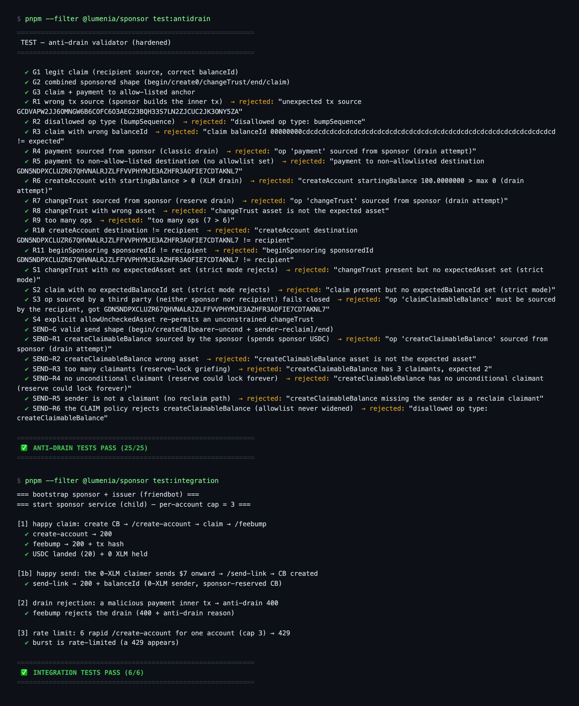

# Instawards Evidence Package — Lumenia (30-day testnet sprint)

> Reviewer-facing evidence for the SOW deliverables ([INSTAWARDS_SOW.md](INSTAWARDS_SOW.md)).
> Everything below is on the **public Stellar testnet** — no real money. Each claim is
> independently verifiable: click the explorer links or re-run the commands.

## The binary success metric — MET

> *"At least one verifiable end-to-end testnet claim: a link tap that lands USDC in a
> freshly sponsored 0-XLM account, evidenced by a public on-chain tx hash."*

**Tx hash:** `b9ef1844c6ca2df732648b965a2f991ba0197643057b2c9e2a60ab52c3e23746`
**Explorer:** <https://stellar.expert/explorer/testnet/tx/b9ef1844c6ca2df732648b965a2f991ba0197643057b2c9e2a60ab52c3e23746>

What the explorer shows: a **fee-bump transaction** whose fee account is the sponsor
(`GDQFGINJ4PMEX4GN53OHFFO657P5APN5BYEEDKRTNYC74FXUBCQTXDLL`) wrapping a
`claimClaimableBalance` sourced by the recipient
(`GCI5ZR6B2TQJDN7VX4TBZAU4J5RBRCKLWYALJEIMPNOM7CTK6AP5PPIR`). The claim was made
from a **real browser** on the live claim page: **20 USDC landed while the recipient
held 0 XLM throughout and paid no fee** — no wallet, no seed phrase, no setup.

---

## D1 — Live sponsor service (testnet)

| Evidence | Where |
|---|---|
| Live service | <https://lumenia-sponsor.vercel.app/health> (returns network + sponsor public key) |
| Endpoints | `POST /create-account` (sponsored 0-XLM account + USDC trustline), `POST /feebump` (anti-drain gate → fee cap → fee-bump → submit) |
| Sponsored account creation via the live service | tx `43ceea89b034fc6484206348b8ab44fafa4a1349101a63a441cb064a0ace0aa8` — <https://stellar.expert/explorer/testnet/tx/43ceea89b034fc6484206348b8ab44fafa4a1349101a63a441cb064a0ace0aa8> — the 4-op sponsored sandwich (beginSponsoring → createAccount(0) → changeTrust → endSponsoring), source **and** fee account = the sponsor `/health` reports; it onboarded the recipient of the binary-metric claim 5 seconds later. (An earlier W1 CLI run, tx `cc8e690f…8320`, used a previous testnet sponsor key that was rotated — testnet keys are disposable.) |
| Signer | Env hot-key (testnet scope per SOW); external raw-Ed25519/KMS signing proven separately (Spike #1b, [PROGRESS.md §4c](PROGRESS.md)) |
| Fee cap | `FEE_BUMP_MAX_STROOPS` enforced in [`apps/sponsor/src/lib/feebump.ts`](apps/sponsor/src/lib/feebump.ts) |
| Rate limiting | Per-IP + per-account on both POST endpoints ([`apps/sponsor/src/lib/rate-limit.ts`](apps/sponsor/src/lib/rate-limit.ts)), **durable across serverless instances** (Upstash Redis fixed-window; in-memory fallback). Proven live 2026-07-11: 12 concurrent `/create-account` for one account → 5×200 (cap) + 7×429 |
| Public repo | <https://github.com/mericcintosun/lumenia> |

## D2 — End-to-end walletless claim (testnet)

| Evidence | Where |
|---|---|
| On-chain claim | tx `b9ef1844…` above (the binary metric) |
| Live claim page | <https://lumenia-chi.vercel.app> — value-first: the amount is shown **before** any credential or action; the bearer key travels in the URL `#fragment` and is never sent to a server |
| 60-second demo video | *to be attached with submission* |
| Flow | link tap → value-first page → "Claim my money" → `/create-account` → client-signed claim → `/feebump` → on-screen explorer tx link |

## D3 — Anti-drain protection, wired and tested

| Evidence | Where |
|---|---|
| Validator gating every live `/feebump` | [`apps/sponsor/src/lib/anti-drain.ts`](apps/sponsor/src/lib/anti-drain.ts) — allowlist over op **types, sources and parameters**, strict-by-default (a missing constraint rejects) |
| Unit tests | **25/25** — `pnpm --filter @lumenia/sponsor test:antidrain` (no network; same module the deployed function bundles). 5 legitimate shapes accepted, 20 drain/griefing vectors rejected |
| Integration tests | **6/6** — `pnpm --filter @lumenia/sponsor test:integration` (real HTTP: happy claim lands 20 USDC at 0 XLM, a 0-XLM onward send creates a sponsored CB, a malicious payment is rejected 400, a burst 429s) |
| Live drain rejection (deployed service) | A sponsor-sourced `payment` inner tx POSTed to the **production** `/feebump` returns `400 {"error":"anti-drain rejected the inner tx: op 'payment' sourced from sponsor (drain attempt)"}` (2026-07-11) |
| Plain-language write-up | [ANTI_DRAIN.md](ANTI_DRAIN.md) |

> **Why the count differs from the SOW.** The SOW (§4.1, written 2026-06-18) cites **14/14**. The suite has
> since grown to **25/25**: hardening during the sprint added the strict-by-default fail-closed cases and
> more drain vectors (14 → 18), and the post-SOW onward-send feature added a **separate, tight `/send-link`
> policy** with 7 cases of its own (18 → 25) — the claim allowlist was never widened to accommodate it.
> The count went up because coverage went up; no SOW-era test was removed or weakened.

### Test output (2026-07-15)



Verbatim:

```
 ✅ ANTI-DRAIN TESTS PASS (25/25)
```

```
=== bootstrap sponsor + issuer (friendbot) ===
=== start sponsor service (child) — per-account cap = 3 ===

[1] happy claim: create CB → /create-account → claim → /feebump
  ✔ create-account → 200
  ✔ feebump → 200 + tx hash
  ✔ USDC landed (20) + 0 XLM held

[1b] happy send: the 0-XLM claimer sends $7 onward → /send-link → CB created
  ✔ send-link → 200 + balanceId (0-XLM sender, sponsor-reserved CB)

[2] drain rejection: a malicious payment inner tx → anti-drain 400
  ✔ feebump rejects the drain (400 + anti-drain reason)

[3] rate limit: 6 rapid /create-account for one account (cap 3) → 429
  ✔ burst is rate-limited (a 429 appears)

 ✅ INTEGRATION TESTS PASS (6/6)
```

---

## Deviations from the SOW as written

The SOW was written on 2026-06-18, before the service was deployed. Three of its
implementation details did not survive contact with the deployment target. Each is a
deliberate engineering decision, not a shortcut — the **deliverable and its intent are
unchanged in every case**. They are listed here so a reviewer does not have to find
them by reading the diff.

**1. The validator is not imported from `@lumenia/shared`.**
*SOW D1:* "Imports the validator from the built `@lumenia/shared` package."
*Built:* the validator lives at [`apps/sponsor/src/lib/anti-drain.ts`](apps/sponsor/src/lib/anti-drain.ts).
*Why:* Vercel uploads only the linked project directory, so a `workspace:*` import fails
the build — npm cannot resolve the protocol on a standalone upload. The validator moved
into the sponsor, where it also belongs conceptually: the web builds the inner tx, only
the sponsor validates it.
*Intent preserved:* there is still exactly **one** canonical validator module and no
duplicate anywhere in the repo. `test-antidrain.ts` imports the same file that esbuild
inlines into the deployed function, so the tests still exercise the deployed gate — which
is what the SOW clause was protecting against.

**2. The sponsor runs ESM, not CJS; the ESM↔CJS parity test became an XDR wire-parity test.**
*SOW D1 / Week 1:* "Node sponsor service (CJS)… with a test proving web(ESM) ↔ sponsor(CJS) parity."
*Built:* `apps/sponsor` is `"type": "module"`; the **deployed artifact** is a self-contained
CJS bundle produced by esbuild (`build-vercel.mjs` → `api/*.js`).
*Why:* plain Node-ESM on Vercel fails on the `@stellar/stellar-sdk` → `@stellar/js-xdr`
`config` export interop. Bundling resolves every module at build time, so the deployed
function does no runtime resolution. This is the only configuration that deploys cleanly.
*Intent preserved:* the risk that clause targeted was **"does the transaction survive the
web→sponsor boundary intact?"** — a module-system concern only because the boundary was
assumed to be one. That risk is proven directly instead, at the level that actually
matters: **Spike #1c** asserts the inner tx re-parses from base64 XDR **byte-identically**
(`reparsed.hash() === original.hash()`), that the canonical validator accepts the re-parsed
tx, and that a fee-bump around it is network-accepted. The live browser claim (`b9ef1844…`)
then proved the same boundary end-to-end in production.

**3. `/feebump` has no explicit polling loop.**
*SOW D1:* "…submits, and polls until the transaction confirms SUCCESS/FAILED before responding."
*Built:* the endpoint awaits Horizon's synchronous `submitTransaction`
([`apps/sponsor/src/lib/stellar.ts`](apps/sponsor/src/lib/stellar.ts)), which returns only
once the transaction has been included in a ledger, or throws with Horizon's `extras`.
*Intent preserved:* the observable behaviour the clause specifies holds exactly — the
response reflects a final outcome and never a pending state. Only the mechanism differs
(Horizon blocks; we do not poll it ourselves).

**4. The test count grew: 14/14 → 25/25.** See the note under D3 above.

## What you will see in the repo beyond this SOW

The repository has continued past the sprint, so a reviewer will find code that this SOW
does not cover and does not claim as evidence. None of it is SOW-scoped work and none of
it touches the frozen claim path:

- **Onward send** (`/send-link`, `/send`, `/sent/[id]`) — a recipient who claimed can send
  a link of their own. Gated by a **separate** anti-drain policy; the claim allowlist is
  untouched. Proven by Spike #5 (7/7, testnet).
- **Local key encryption** (`lib/argon.ts`, `lib/keystore.ts`, `/unlock`) — Argon2id-derived
  AES-GCM encryption of the seed in IndexedDB. To be precise about the SOW's out-of-scope
  line: there is **no account recovery, no WebAuthn/passkey/Face ID, and no seed export** —
  those remain unbuilt. This is local at-rest encryption only.
- **Support endpoints** (`/faucet`, `/demo-link`, `/waitlist`, `/events`) and the marketing
  site + brand kit.

The SOW deliverables above (D1/D2/D3) are evidenced on their own terms and do not depend
on any of this.

## Out of scope (per SOW §4.1)

Mainnet/real money, live fiat conversion (delegated to a licensed provider — the claim
page ships a disabled **placeholder** only), account recovery/passkeys, request-money,
WhatsApp automation, production KMS/HSM, DB/SEP-7, abuse-at-scale handling.

## Re-run everything

```bash
git clone https://github.com/mericcintosun/lumenia && cd lumenia
pnpm install
pnpm --filter @lumenia/sponsor test:antidrain     # 25/25, no network
pnpm --filter @lumenia/sponsor test:integration   # 6/6, testnet (friendbot; can be slow if friendbot rate-limits)
curl https://lumenia-sponsor.vercel.app/health    # live service
```
