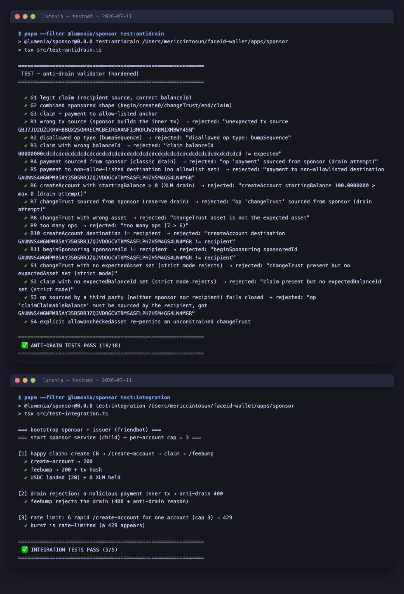

# Instawards Evidence Package — Lumenia (30-day testnet sprint)

> Reviewer-facing evidence for the SOW deliverables ([INSTAWARDS_SOW.md](INSTAWARDS_SOW.md)).
> Everything below is on the **public Stellar testnet** — no real money. Each claim is
> independently verifiable: click the explorer links or re-run the commands.

## The binary success metric — MET

> *"At least one verifiable end-to-end testnet claim: a link tap that lands USDC in a
> freshly sponsored 0-XLM account, evidenced by a public on-chain tx hash."*

**Tx hash:** `b9ef1844c6ca2df732648b965a2f991ba0197643057b2c9e2a60ab52c3e23746`
**Explorer:** <https://stellar.expert/explorer/testnet/tx/b9ef1844c6ca2df732648b965a2f991ba0197643057b2c9e2a60ab52c3e23746>

What the explorer shows: a **fee-bump transaction** whose fee account is the sponsor
(`GDQFGINJ4PMEX4GN53OHFFO657P5APN5BYEEDKRTNYC74FXUBCQTXDLL`) wrapping a
`claimClaimableBalance` sourced by the recipient
(`GCI5ZR6B2TQJDN7VX4TBZAU4J5RBRCKLWYALJEIMPNOM7CTK6AP5PPIR`). The claim was made
from a **real browser** on the live claim page: **20 USDC landed while the recipient
held 0 XLM throughout and paid no fee** — no wallet, no seed phrase, no setup.

---

## D1 — Live sponsor service (testnet)

| Evidence | Where |
|---|---|
| Live service | <https://lumenia-sponsor.vercel.app/health> (returns network + sponsor public key) |
| Endpoints | `POST /create-account` (sponsored 0-XLM account + USDC trustline), `POST /feebump` (anti-drain gate → fee cap → fee-bump → submit) |
| Sponsored account creation via the live service | tx `cc8e690f2b1c57d172c104e615690a58388e8e393a178976767f0f95c6b48320` — <https://stellar.expert/explorer/testnet/tx/cc8e690f2b1c57d172c104e615690a58388e8e393a178976767f0f95c6b48320> |
| Signer | Env hot-key (testnet scope per SOW); external raw-Ed25519/KMS signing proven separately (Spike #1b, [PROGRESS.md §4c](PROGRESS.md)) |
| Fee cap | `FEE_BUMP_MAX_STROOPS` enforced in [`apps/sponsor/src/lib/feebump.ts`](apps/sponsor/src/lib/feebump.ts) |
| Rate limiting | Per-IP + per-account on both POST endpoints ([`apps/sponsor/src/lib/rate-limit.ts`](apps/sponsor/src/lib/rate-limit.ts)), **durable across serverless instances** (Upstash Redis fixed-window; in-memory fallback). Proven live 2026-07-11: 12 concurrent `/create-account` for one account → 5×200 (cap) + 7×429 |
| Public repo | <https://github.com/mericcintosun/lumenia> |

## D2 — End-to-end walletless claim (testnet)

| Evidence | Where |
|---|---|
| On-chain claim | tx `b9ef1844…` above (the binary metric) |
| Live claim page | <https://lumenia-chi.vercel.app> — value-first: the amount is shown **before** any credential or action; the bearer key travels in the URL `#fragment` and is never sent to a server |
| 60-second demo video | *to be attached with submission* |
| Flow | link tap → value-first page → "Paramı al" → `/create-account` → client-signed claim → `/feebump` → on-screen explorer tx link |

## D3 — Anti-drain protection, wired and tested

| Evidence | Where |
|---|---|
| Validator gating every live `/feebump` | [`apps/sponsor/src/lib/anti-drain.ts`](apps/sponsor/src/lib/anti-drain.ts) — allowlist over op **types, sources and parameters**, strict-by-default (a missing constraint rejects) |
| Unit tests | **18/18** — `pnpm --filter @lumenia/sponsor test:antidrain` (no network; same module the deployed function bundles) |
| Integration tests | **5/5** — `pnpm --filter @lumenia/sponsor test:integration` (real HTTP: happy claim lands 20 USDC at 0 XLM, a malicious payment is rejected 400, a burst 429s) |
| Live drain rejection (deployed service) | A sponsor-sourced `payment` inner tx POSTed to the **production** `/feebump` returns `400 {"error":"anti-drain rejected the inner tx: op 'payment' sourced from sponsor (drain attempt)"}` (2026-07-11) |
| Plain-language write-up | [ANTI_DRAIN.md](ANTI_DRAIN.md) |

### Test output (2026-07-11)



Verbatim:

```
 ✅ ANTI-DRAIN TESTS PASS (18/18)
```

```
[1] happy claim: create CB → /create-account → claim → /feebump
  ✔ create-account → 200
  ✔ feebump → 200 + tx hash
  ✔ USDC landed (20) + 0 XLM held
[2] drain rejection: a malicious payment inner tx → anti-drain 400
  ✔ feebump rejects the drain (400 + anti-drain reason)
[3] rate limit: 6 rapid /create-account for one account (cap 3) → 429
  ✔ burst is rate-limited (a 429 appears)
 ✅ INTEGRATION TESTS PASS (5/5)
```

---

## Out of scope (per SOW §4.1)

Mainnet/real money, live fiat conversion (delegated to a licensed provider — the claim
page ships a disabled **placeholder** only), account recovery/passkeys, request-money,
WhatsApp automation, production KMS/HSM, DB/SEP-7, abuse-at-scale handling.

## Re-run everything

```bash
git clone https://github.com/mericcintosun/lumenia && cd lumenia
pnpm install
pnpm --filter @lumenia/sponsor test:antidrain     # 18/18, no network
pnpm --filter @lumenia/sponsor test:integration   # 5/5, testnet (friendbot; can be slow if friendbot rate-limits)
curl https://lumenia-sponsor.vercel.app/health    # live service
```
