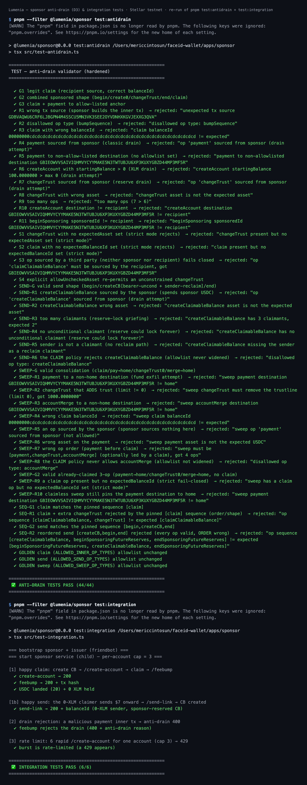

# Instawards Evidence Package — Lumenia (30-day testnet sprint)

> Reviewer-facing evidence for the SOW deliverables ([INSTAWARDS_SOW.md](INSTAWARDS_SOW.md)).
> Everything below is on the **public Stellar testnet** — no real money. Each claim is
> independently verifiable: click the explorer links or re-run the commands.

## The binary success metric — MET

> *"At least one verifiable end-to-end testnet claim: a link tap that lands USDC in a
> freshly sponsored 0-XLM account, evidenced by a public on-chain tx hash."*

**Tx hash:** `b9ef1844c6ca2df732648b965a2f991ba0197643057b2c9e2a60ab52c3e23746`
**Explorer:** <https://stellar.expert/explorer/testnet/tx/b9ef1844c6ca2df732648b965a2f991ba0197643057b2c9e2a60ab52c3e23746>

What the explorer shows: a **fee-bump transaction** whose fee account is the sponsor
(`GDQFGINJ4PMEX4GN53OHFFO657P5APN5BYEEDKRTNYC74FXUBCQTXDLL`) wrapping a
`claimClaimableBalance` sourced by the recipient
(`GCI5ZR6B2TQJDN7VX4TBZAU4J5RBRCKLWYALJEIMPNOM7CTK6AP5PPIR`). The claim was made
from a **real browser** on the live claim page: **20 USDC landed while the recipient
held 0 XLM throughout and paid no fee** — no wallet, no seed phrase, no setup.

**Still true on the current live path.** The sponsor has since moved to a single
Cloudflare Worker (see D1) and the anti-drain validator has been hardened (see D3). A
fresh end-to-end claim through that current path re-proves the same metric:
tx `21816364fbe2460ac58c2fcf54dfdf24b71f71ad3344f7358dad12d2aa772203`
(<https://stellar.expert/explorer/testnet/tx/21816364fbe2460ac58c2fcf54dfdf24b71f71ad3344f7358dad12d2aa772203>)
— again **20 USDC into a freshly sponsored 0-XLM account**. The original `b9ef1844…`
capture remains valid evidence; this newer one shows the metric holds on today's stack.

---

## D1 — Live sponsor service (testnet)

| Evidence | Where |
|---|---|
| Live service | <https://lumenia-sponsor.avakit.workers.dev/health> (returns network + sponsor public key) — a single **Cloudflare Worker** (`apps/sponsor/src/worker.ts`), deployed with `cd apps/sponsor && npx wrangler deploy`. (It replaced the earlier Vercel serverless deployment, which capped a project at 12 functions; the Worker has no function limit.) |
| Endpoints | Core claim path: `POST /create-account` (sponsored 0-XLM account + USDC trustline), `POST /feebump` (anti-drain gate → fee cap → fee-bump → submit). Full surface: `/health`, `/create-account`, `/feebump`, `/send-link`, `/sweep`, `/faucet`, `/demo-link`, `/waitlist`, `/feedback`, `/events`, `/v2-deposit`, `/v2-claim`, `/v2-reclaim`, `/recovery-otp`, `/recovery`, `/recovery-fetch`. The `/v2-*` and `/recovery-*` endpoints are post-SOW (see "Beyond the SOW" below); none of them widens the claim path. |
| Sponsored account creation via the live service | tx `43ceea89b034fc6484206348b8ab44fafa4a1349101a63a441cb064a0ace0aa8` — <https://stellar.expert/explorer/testnet/tx/43ceea89b034fc6484206348b8ab44fafa4a1349101a63a441cb064a0ace0aa8> — the 4-op sponsored sandwich (beginSponsoring → createAccount(0) → changeTrust → endSponsoring), source **and** fee account = the sponsor `/health` reports; it onboarded the recipient of the binary-metric claim 5 seconds later. (An earlier W1 CLI run, tx `cc8e690f…8320`, used a previous testnet sponsor key that was rotated — testnet keys are disposable.) |
| Signer | Env hot-key (testnet scope per SOW); external raw-Ed25519/KMS signing proven separately (Spike #1b, [PROGRESS.md §4c](PROGRESS.md)) |
| Fee cap | `FEE_BUMP_MAX_STROOPS` enforced in [`apps/sponsor/src/lib/feebump.ts`](apps/sponsor/src/lib/feebump.ts) |
| Rate limiting | Per-IP + per-account on both POST endpoints ([`apps/sponsor/src/lib/rate-limit.ts`](apps/sponsor/src/lib/rate-limit.ts)), **durable across instances** (Upstash Redis fixed-window; in-memory fallback). Proven live 2026-07-11: 12 concurrent `/create-account` for one account → 5×200 (cap) + 7×429 |
| Public repo | <https://github.com/getlumenia/lumenia> |

## D2 — End-to-end walletless claim (testnet)

| Evidence | Where |
|---|---|
| On-chain claim | tx `b9ef1844…` above (the binary metric), re-proven on today's stack by `21816364…` |
| Live claim page | <https://getlumenia.com> — value-first: the amount is shown **before** any credential or action; the bearer key travels in the URL `#fragment` and is never sent to a server |
| 60-second demo video | *to be attached with submission* |
| Flow | link tap → value-first page → "Claim my money" → `/create-account` → client-signed claim → `/feebump` → on-screen explorer tx link |
| SOW-scoped route | This D2 claim is the **v1 classic Claimable Balance** route (`/c/[id]`) — the frozen grant-evidence path (webfont-free, unchanged mechanics). Since the sprint, the app's **default shareable link-send** is a v2 Soroban escrow with a separate claim route (`/v2/c/[…]`, see "Beyond the SOW"); both run side by side, and this SOW is evidenced entirely on the v1 route. |

## D3 — Anti-drain protection, wired and tested

| Evidence | Where |
|---|---|
| Validator gating every live `/feebump` | [`apps/sponsor/src/lib/anti-drain.ts`](apps/sponsor/src/lib/anti-drain.ts) — allowlist over op **types, sources and parameters**, strict-by-default (a missing constraint rejects) |
| Unit tests | **44/44** — `pnpm --filter @lumenia/sponsor test:antidrain` (no network; the same module the deployed Worker uses). Breakdown: **18 claim + 7 send + 12 sweep + 4 op-sequence + 3 golden-policy**. The SOW cited 14/14; the suite grew to 44/44 (see the growth note below) — re-running today prints 44/44 |
| Integration tests | **6/6** — `pnpm --filter @lumenia/sponsor test:integration` (real HTTP: happy claim lands 20 USDC at 0 XLM, a 0-XLM onward send creates a sponsored CB, a malicious payment is rejected 400, a burst 429s) |
| Live drain rejection (deployed service) | A sponsor-sourced `payment` inner tx POSTed to the **production** `/feebump` returns `400 {"error":"anti-drain rejected the inner tx: op 'payment' sourced from sponsor (drain attempt)"}` (2026-07-11) |
| Plain-language write-up | [ANTI_DRAIN.md](ANTI_DRAIN.md) |

> **Why the count differs from the SOW.** The SOW (§4.1, written 2026-06-18) cites **14/14**. The suite has
> since grown to **44/44**: sprint hardening added strict-by-default fail-closed cases + more drain vectors
> (14 → 18); the post-SOW onward-send feature added a **separate, tight `/send-link` policy** (18 → 25); the
> recovery-consolidation **sweep policy** added 12 (25 → 37); and an op-**sequence** matcher + a
> **golden-policy** snapshot added 7 (37 → 44). The claim allowlist was never widened — the count went up
> because coverage went up, and no SOW-era test was removed or weakened. (The capture below is a fresh
> **44/44** run; the earlier SOW-era 25/25 capture is kept at `evidence/tests-25-25-and-6-6.png` for history.)

### Test output (2026-07-22)



Verbatim:

```
 ✅ ANTI-DRAIN TESTS PASS (44/44)
```

```
=== bootstrap sponsor + issuer (friendbot) ===
=== start sponsor service (child) — per-account cap = 3 ===

[1] happy claim: create CB → /create-account → claim → /feebump
  ✔ create-account → 200
  ✔ feebump → 200 + tx hash
  ✔ USDC landed (20) + 0 XLM held

[1b] happy send: the 0-XLM claimer sends $7 onward → /send-link → CB created
  ✔ send-link → 200 + balanceId (0-XLM sender, sponsor-reserved CB)

[2] drain rejection: a malicious payment inner tx → anti-drain 400
  ✔ feebump rejects the drain (400 + anti-drain reason)

[3] rate limit: 6 rapid /create-account for one account (cap 3) → 429
  ✔ burst is rate-limited (a 429 appears)

 ✅ INTEGRATION TESTS PASS (6/6)
```

---

## Deviations from the SOW as written

The SOW was written on 2026-06-18, before the service was deployed. Three of its
implementation details did not survive contact with the deployment target. Each is a
deliberate engineering decision, not a shortcut — the **deliverable and its intent are
unchanged in every case**. They are listed here so a reviewer does not have to find
them by reading the diff.

**1. The validator is not imported from `@lumenia/shared`.**
*SOW D1:* "Imports the validator from the built `@lumenia/shared` package."
*Built:* the validator lives at [`apps/sponsor/src/lib/anti-drain.ts`](apps/sponsor/src/lib/anti-drain.ts).
*Why:* Vercel uploads only the linked project directory, so a `workspace:*` import fails
the build — npm cannot resolve the protocol on a standalone upload. The validator moved
into the sponsor, where it also belongs conceptually: the web builds the inner tx, only
the sponsor validates it.
*Intent preserved:* there is still exactly **one** canonical validator module and no
duplicate anywhere in the repo. `test-antidrain.ts` imports the same file that esbuild
inlines into the deployed function, so the tests still exercise the deployed gate — which
is what the SOW clause was protecting against.

**2. The sponsor runs ESM, not CJS; the ESM↔CJS parity test became an XDR wire-parity test.**
*SOW D1 / Week 1:* "Node sponsor service (CJS)… with a test proving web(ESM) ↔ sponsor(CJS) parity."
*Built:* `apps/sponsor` is `"type": "module"`; the **deployed artifact** is a self-contained
CJS bundle produced by esbuild (`build-vercel.mjs` → `api/*.js`).
*Why:* plain Node-ESM on Vercel fails on the `@stellar/stellar-sdk` → `@stellar/js-xdr`
`config` export interop. Bundling resolves every module at build time, so the deployed
function does no runtime resolution. This is the only configuration that deploys cleanly.
*Intent preserved:* the risk that clause targeted was **"does the transaction survive the
web→sponsor boundary intact?"** — a module-system concern only because the boundary was
assumed to be one. That risk is proven directly instead, at the level that actually
matters: **Spike #1c** asserts the inner tx re-parses from base64 XDR **byte-identically**
(`reparsed.hash() === original.hash()`), that the canonical validator accepts the re-parsed
tx, and that a fee-bump around it is network-accepted. The live browser claim (`b9ef1844…`)
then proved the same boundary end-to-end in production.

**3. `/feebump` has no explicit polling loop.**
*SOW D1:* "…submits, and polls until the transaction confirms SUCCESS/FAILED before responding."
*Built:* the endpoint awaits Horizon's synchronous `submitTransaction`
([`apps/sponsor/src/lib/stellar.ts`](apps/sponsor/src/lib/stellar.ts)), which returns only
once the transaction has been included in a ledger, or throws with Horizon's `extras`.
*Intent preserved:* the observable behaviour the clause specifies holds exactly — the
response reflects a final outcome and never a pending state. Only the mechanism differs
(Horizon blocks; we do not poll it ourselves).

**4. The test count grew: 14/14 → 44/44.** See the note under D3 above.

> **Note on the host.** Deviations 1–2 were written when the sponsor deployed to Vercel.
> It has since moved to a single **Cloudflare Worker** (`apps/sponsor/src/worker.ts`,
> `wrangler deploy`) because recovery pushed the endpoint count past Vercel's 12-function
> Hobby cap. The reasoning above is now historical, but the outcomes it protected still
> hold: there is still exactly **one** canonical validator module, and Spike #1c's XDR
> wire-parity proof (the inner tx re-parses byte-identically across the web→sponsor
> boundary) is independent of the runtime host.

## Beyond the SOW (shipped since)

The repository has continued past the sprint, so a reviewer will find code that this SOW
does not cover and does not claim as evidence. All of it is **testnet** and **none of it
touches the frozen v1 claim path** (`/c/[id]`) evidenced above. Listed here so a reviewer
sees the current shape of the repo, not to expand the SOW's claims:

- **v2 Soroban `LumenDrop` escrow** (testnet) — the app's **default shareable link-send** is
  now a smart-contract drop with a **late-bound payout**: the link key does not hold the
  money, it authorizes a payout to an address chosen at claim time, verified inside the
  contract, so the relayer can never redirect a stroop. The relayer pays the Soroban fee,
  so the flow stays walletless and the recipient still pays no gas. Proven on-chain (7/7)
  plus native unit tests and a fund-conservation proptest; a separate v2 claim route
  (`/v2/c/[…]`). Mainnet is gated on an audit.
- **Account recovery** (`lib/recovery.ts`, `/account`) — password + email-OTP recovery of
  the on-device seed, plus a WebAuthn-PRF "Face ID" fast-unlock upgrade. One 32-byte seed,
  two wraps (Argon2id → AES-GCM as the floor; PRF → HKDF → AES-GCM as the upgrade), stored
  as a **ciphertext-only, zero-knowledge box the server cannot open** (OTP-gated, isolated
  store, separate rate-limit bucket). Recovery self-test 13/13. Owner-gated while the OTP
  email domain is being verified; there is still **no seed-export** path.
- **Channel-account concurrency** (`lib/channels.ts`) — a pool of sponsor-controlled channel
  accounts, each lending a transaction sequence under an exclusive Upstash Redis lease,
  removes the single-sequence bottleneck. Proven 20/20 concurrent with 0 `tx_bad_seq`.
- **Recover / reclaim ("Take it back")** — a sender can reclaim an abandoned drop without paying gas (the sponsor fee-bumps)
  for both the classic (v1, via `/feebump`) and Soroban (v2, via `/v2-reclaim`) paths,
  surfaced as reclaimable notices in the app.
- **Onward send** (`/send-link`, `/send`) — a recipient who claimed can send a link of their
  own, gated by a **separate** anti-drain policy that never widens the claim allowlist
  (Spike #5, 7/7). **Request money** (`/request`, `/r/[id]`) — create a link asking someone
  to pay you; the payer pushes the payment, no pull/debit (Spike #6, 8/8). **Split** across
  N request links (`/split`).
- **Local key encryption** (`lib/argon.ts`, `lib/keystore.ts`, `/unlock`) — Argon2id-derived
  AES-GCM encryption of the seed in IndexedDB, at rest on-device.
- **Support endpoints** (`/faucet`, `/demo-link`, `/waitlist`, `/feedback`, `/events`) and
  the product web app in the "Periwinkle" design system.

The SOW deliverables above (D1/D2/D3) are evidenced on their own terms and do not depend
on any of this.

## Out of scope (per SOW §4.1)

What the SOW deferred: Mainnet/real money, live fiat conversion (delegated to a licensed
provider — the claim page ships a disabled **placeholder** only), account recovery/passkeys,
request-money, WhatsApp automation, production KMS/HSM, DB/SEP-7, abuse-at-scale handling.

Since the sprint, several of these have shipped on **testnet** (account recovery + Face ID,
request-money — see "Beyond the SOW" above). Still genuinely out: mainnet/real money, live
fiat conversion, production KMS/HSM, WhatsApp automation, and abuse-at-scale handling.

## Re-run everything

```bash
git clone https://github.com/getlumenia/lumenia && cd lumenia
pnpm install
pnpm --filter @lumenia/sponsor test:antidrain     # 44/44, no network
pnpm --filter @lumenia/sponsor test:integration   # 6/6, testnet (friendbot; can be slow if friendbot rate-limits)
curl https://lumenia-sponsor.avakit.workers.dev/health   # live service (Cloudflare Worker)

# deploy the sponsor (Cloudflare Worker):
cd apps/sponsor && npx wrangler deploy
```
